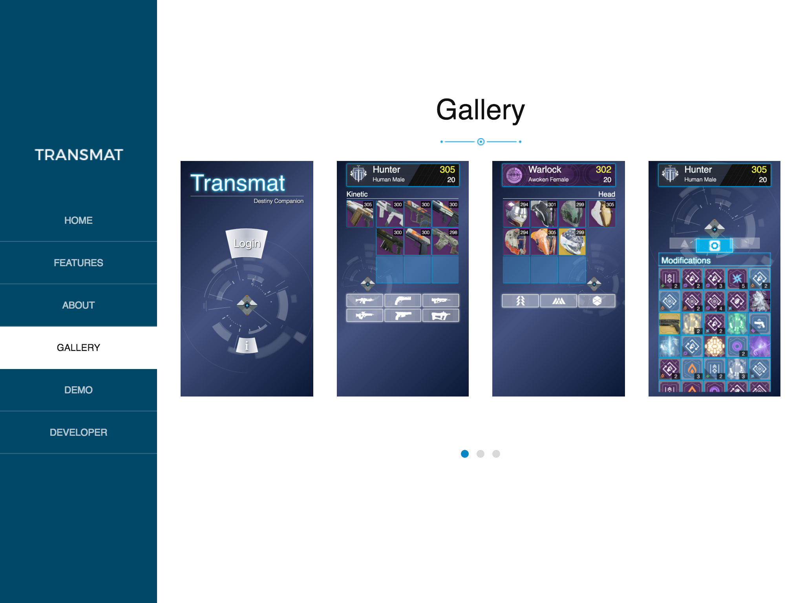

# Transmat - Landing Page

This website is the landing page for the web application [Transmat](https://destinytransmat.com "Transmat - Destiny Companion"). It serves to educate users about the app, as well as provide a launch link for its live and demo versions. 
  
 ## Composable Components
 
 ### Responsive Navigation

 <table>
 <tr>
 <td>
 
 
 
 </td>
 </tr>
 </table>
 
 ### Accordion

 <table>
 <tr>
 <td>
  
 
 
 </td>
 </tr>
 </table>
 
 ### Slider
 
 <table>
 <tr>
 <td>
   
 
 
 </td>
 </tr>
 </table>
 
 
 ## Built With
 [ES6](https://github.com/lukehoban/es6features "ES6 Overview - GitHub") - Latest version of ECMAScript; adds powerful new JavaScript features such as module loading, arrow functions, and classes.
 
 [React](https://reactjs.org "React Homepage") - JavaScript library for building component based interfaces.